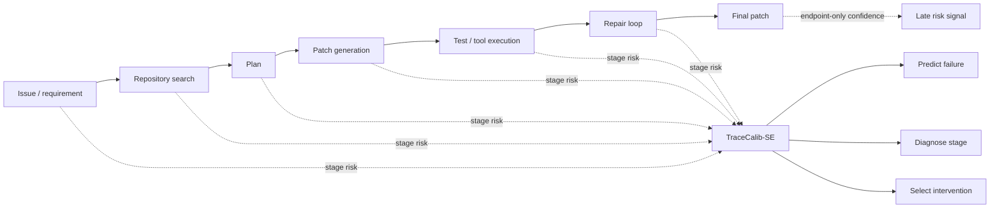
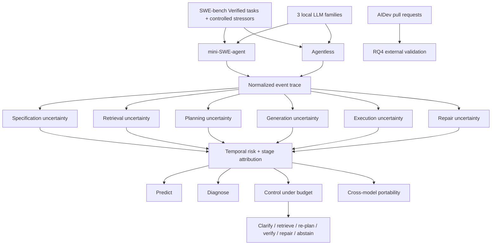

# TraceCalib-SE

**Process-Level Uncertainty Propagation and Selective Control for Reliable Software Engineering Agents**

TraceCalib-SE is a reproducible research framework for testing whether repository-level coding agents can **predict**, **diagnose**, **control**, and **transfer** their own failure-risk signals from complete software-engineering trajectories.

> **Status:** infrastructure + pilot preparation. Numerical results are intentionally absent until the frozen analysis pipeline produces them.

## Motivation

Most coding-agent evaluations observe the final patch and ask whether it passes. TraceCalib-SE instead asks where risk emerges during the workflow and whether that risk is useful early enough to change the outcome.



**Publication-quality motivation figure:** [PDF](docs/figures/fig1_motivation.pdf)

## Framework / pipeline



**Publication-quality framework figure:** [PDF](docs/figures/fig2_framework.pdf)  
**RQ5 reporting shell:** [PDF](docs/figures/fig11_rq5_model_portability_TBD.pdf)

## Research questions

**RQ1 — Early failure prediction.** How accurately and how early can stage-wise uncertainty predict final coding-agent failure?

**H1.** Trace-level uncertainty models outperform final verbal confidence, token-likelihood features, self-consistency, and simple trajectory statistics at 25%, 50%, 75%, and 100% of execution.

**RQ2 — Decomposition and transfer.** Which uncertainty components dominate different failure modes, and does decomposition improve transfer?

**H2.** A decomposed model produces better stage attribution and cross-repository calibration than an equally sized scalar-risk model.

**RQ3 — Selective control.** Can uncertainty-specific interventions improve task success under a fixed computational budget?

**H3.** Stage-aware control dominates static retry, final-confidence abstention, test-failure-only repair, and stage-blind conformal control on the success-cost frontier.

**RQ4 — External validation.** Do benchmark-derived uncertainty categories explain human review friction in real agent-authored pull requests?

**H4.** Specification, approach, implementation, testing, and operational uncertainty categories are associated with rejection, revision count, review duration, or human intervention in AIDev pull requests.

**RQ5 — Model portability.** How portable are stage-wise uncertainty estimates and selective-control gains across heterogeneous LLM families and access regimes?

**H5.** A common black-box stage-wise representation exhibits smaller transfer degradation in discrimination, calibration, and control utility than endpoint-only confidence or model-specific uncertainty features under leave-one-model-family-out evaluation, with directionally consistent behavior on the frozen API robustness tier.

## Models

### Primary local families
| Model | Role | Default deployment |
|---|---|---|
| `Qwen/Qwen3-8B` | primary local | local, pinned revision |
| `mistralai/Mistral-7B-Instruct-v0.3` | primary local | local, pinned revision |
| `google/gemma-3-12b-it` | local robustness / RQ5 family | gated + validated local/quantized deployment |

### Secondary API portability tier
OpenAI `gpt-5.6-terra`, Anthropic `claude-sonnet-5`, DeepSeek `deepseek-v4-flash`, and Google `gemini-3.7-flash` are candidate black-box portability endpoints. Exact endpoint strings, access dates, settings, and pricing are frozen before execution. This tier is **not** a provider leaderboard.

## Agents and datasets

- **mini-SWE-agent** — interactive, linear, trace-friendly execution.
- **Agentless** — localization -> repair -> validation.
- **SWE-bench Verified** (`princeton-nlp/SWE-bench_Verified`) — primary RQ1/RQ2/RQ3/RQ5 controlled benchmark.
- **AIDev** (`hao-li/AIDev`) — RQ4 external validation.

Raw benchmark repositories, model weights, Docker environments, and unrestricted traces are not committed. The repository stores acquisition scripts, pinned manifests, hashes, schemas, and derived/releasable metadata.

## Hardware profile

Current lab profile, to be verified by preflight before publication:

- Windows 11 workstation
- 64 GB system RAM
- user-reported dual-GPU configuration; exact inventory **TO VERIFY**
- captured device: NVIDIA GeForce RTX 5070 Ti
- captured device memory: 15.92 GiB

`python scripts/preflight.py --write artifacts/machine_manifest.json` records the exact GPU count, VRAM, driver, CUDA/PyTorch, WSL2, Docker, and software versions.

## Repository layout

```text
TraceCalib/
├── configs/experiments/        # pilot, main study, RQ5 portability
├── data/manifests/             # versioned dataset manifests only
├── docs/                       # protocol and scientific contracts
│   └── figures/                # editable vector PDF figures
├── scripts/                    # preflight, data, pilot, RQ5 evaluation
├── src/tracecalib/
│   ├── evaluation/             # metrics and portability evaluation
│   ├── instrumentation/        # normalized trace schema
│   ├── providers/              # local/API provider interfaces
│   └── reporting/              # result-table contracts
├── tests/
├── results/                    # generated empirical outputs
├── AGENTS.md                   # research-integrity rules
└── .env.example
```

## Quick start

```bash
git clone https://github.com/Rocky5502/TraceCalib.git
cd TraceCalib
python -m venv .venv
source .venv/bin/activate
pip install -e '.[dev,ml]'
python scripts/preflight.py --write artifacts/machine_manifest.json
python scripts/validate_config.py
python scripts/check_local_models.py
python scripts/download_datasets.py --all
pytest -q
```

Run the **pilot only** before scaling:

```bash
python scripts/run_pilot.py --config configs/experiments/pilot.yaml
```

RQ5 plumbing can be tested without contaminating `results/`:

```bash
python scripts/smoke_rq5.py
```

The smoke fixture is synthetic and writes only under `artifacts/smoke/`; it is never a manuscript result.

After real frozen predictions exist:

```bash
python scripts/evaluate_rq5.py \
  --predictions artifacts/frozen/rq5_predictions.parquet \
  --output-dir results/rq5
```

## Result contract

All manuscript results are generated from machine-readable artifacts. Required tables cover run accounting, sample characteristics, RQ1 failure prediction/early warning, RQ2 attribution/decomposition, RQ3 selective control/action effectiveness, RQ4 AIDev validation, **RQ5 model portability**, ablations, and resource cost.

Primary metrics include AUROC, AUPRC, Brier, NLL, ECE/ACE, warning lead time, Macro-F1, risk-coverage, success-cost area, held-out-model AUROC retention, and ECE degradation. Repository-grouped intervals and matched-budget comparisons are mandatory.

## Research integrity

- No fabricated or manually typed result values.
- No gold patches, future trajectory events, final labels, or hidden-test outcomes as online features.
- Repository-disjoint train/calibration/test partitions.
- Target model family excluded from RQ5 model fitting and calibration.
- Infrastructure/provider failures separated from agent failures.
- Model/dataset/agent/provider revisions pinned before sealed evaluation.
- Null and negative findings retained.
- API targets not executed under the frozen budget are reported `N/A`.
- Secrets, model weights, raw benchmark checkouts, and private traces stay outside Git.

## License

Original TraceCalib-SE research code is Apache-2.0. Third-party models, datasets, and upstream agent repositories retain their own licenses and terms.
